# Jenkins CI/CD Maintainer

An AI-powered teammate that helps diagnose and fix Jenkins pipeline failures. The maintainer monitors your Jenkins jobs for failures, analyzes build logs, and provides detailed solutions to help resolve issues quickly.

## 🎯 Overview

The Jenkins CI/CD Maintainer is designed to:
- Monitor Jenkins jobs and pipeline failures
- Analyze build logs and error patterns
- Provide detailed root cause analysis
- Suggest fixes with code examples
- Integrate with Slack/Teams for notifications
- Support both Jenkins Classic and Jenkins Pipeline (Jenkinsfile) workflows

## 🏗️ Architecture

```mermaid
flowchart TB
    %% Nodes with icons
    TF["🔧 Terraform Module"]
    VARS["📝 variables.tf"]
    MAIN["⚙️ main.tf"]
    FORM["✨ Kubiya UI Form"]
    CONFIG["🎯 User Configuration"]
    PLAN["👀 Review Changes"]
    DEPLOY["🚀 Deploy Resources"]
    
    %% Kubiya Resources
    TEAMMATE["🤖 Jenkins CI/CD Maintainer"]
    WEBHOOK["📡 Event Listener"]
    KB["📚 Knowledge Base"]
    
    %% Tool Sources
    TOOLS["⚡ Tool Sources"]
    JENKINS_TOOLS["🛠️ Jenkins Tools"]
    DIAG_TOOLS["📊 Diagram Tools"]
    SECRETS["🔐 Secrets Store"]
    
    %% Jenkins Resources
    JENKINS_WH["🔗 Jenkins Webhooks"]
    BUILD["❌ Failed Build"]
    SOLUTION["💬 Analysis & Fix"]
    JENKINS_API["🔧 Jenkins API"]

    %% Configuration Flow
    subgraph "1️⃣ Setup Phase"
        TF --> |"defines"| VARS
        TF --> |"contains"| MAIN
        VARS --> |"generates"| FORM
        FORM --> |"fill"| CONFIG
        CONFIG --> |"review"| PLAN
        PLAN --> |"apply"| DEPLOY
    end

    %% Resource Creation
    subgraph "2️⃣ Resources"
        DEPLOY --> |"creates"| TEAMMATE
        DEPLOY --> |"creates"| WEBHOOK
        DEPLOY --> |"creates"| KB
        DEPLOY --> |"configures"| JENKINS_WH
        DEPLOY --> |"provisions"| SECRETS
    end

    %% Tool Sources
    subgraph "3️⃣ Tools & Actions"
        TOOLS --> JENKINS_TOOLS
        TOOLS --> DIAG_TOOLS
        TEAMMATE --> |"uses"| TOOLS
        SECRETS --> |"authenticates"| JENKINS_TOOLS
        JENKINS_TOOLS --> |"interacts"| JENKINS_API
    end

    %% Event Flow
    subgraph "4️⃣ Execution"
        BUILD --> |"triggers"| JENKINS_WH
        JENKINS_WH --> |"notifies"| WEBHOOK
        WEBHOOK --> |"activates"| TEAMMATE
        KB --> |"assists"| TEAMMATE
        TEAMMATE --> |"posts"| SOLUTION
    end

    %% Styling
    classDef setup fill:#e1f5fe,stroke:#01579b,stroke-width:2px,color:black
    classDef resource fill:#f1f8e9,stroke:#33691e,stroke-width:2px,color:black
    classDef tools fill:#6a1b9a,stroke:#4a148c,stroke-width:2px,color:white
    classDef event fill:#fff3e0,stroke:#e65100,stroke-width:2px,color:black
    
    class TF,VARS,MAIN,FORM,CONFIG,PLAN setup
    class DEPLOY,TEAMMATE,WEBHOOK,KB,JENKINS_WH,SECRETS resource
    class TOOLS,JENKINS_TOOLS,DIAG_TOOLS,JENKINS_API tools
    class BUILD,SOLUTION event
```

## 🚀 Quick Start

### Prerequisites
- Kubiya Platform account
- Jenkins instance with API access
- Jenkins API token or username/password credentials
- Slack or Microsoft Teams for notifications (optional)

### Setup Steps
1. **Access Kubiya Platform**
   - Navigate to Use Cases
   - Select "Jenkins CI/CD Maintainer"

2. **Configure Settings**
   - Provide Jenkins URL and credentials
   - Select jobs/pipelines to monitor
   - Configure Slack/Teams notifications
   - Set monitoring preferences

3. **Review & Deploy**
   - Review the generated configuration
   - Apply to create resources
   - Verify webhook setup

## 🛠️ Features

### Automated Analysis
- Real-time Jenkins job failure detection
- Build log analysis and pattern recognition
- Root cause identification
- Performance bottleneck detection
- Support for both Freestyle and Pipeline jobs

### Smart Solutions
- Contextual fix recommendations
- Code examples and snippets
- Best practice suggestions
- Security improvement tips
- Jenkinsfile optimization suggestions

### Integration & Tools
- Jenkins API integration
- Slack/Teams notifications
- Custom organizational knowledge base
- Secure credentials management
- Support for Jenkins plugins analysis

## 📚 Documentation

For detailed setup instructions and configuration options:
- [Setup Guide](https://docs.kubiya.ai/usecases/jenkins-cicd-maintainer/setup)
- [Configuration Reference](https://docs.kubiya.ai/usecases/jenkins-cicd-maintainer/config)
- [Tool Documentation](https://docs.kubiya.ai/usecases/jenkins-cicd-maintainer/tools)

## 🤝 Support

Need help? Contact us:
- [Kubiya Support Portal](https://support.kubiya.ai)
- [Community Discord](https://discord.gg/kubiya)
- Email: support@kubiya.ai
